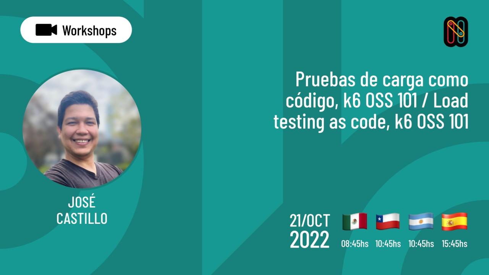

# Workshop - Pruebas de carga como código, k6 OSS 101
Repositorio base para workshop de Nerdearla 2022
basado en [k6-learn](https://github.com/grafana/k6-learn)



## Presentacion
* [Pruebas de carga como código, k6 OSS 101 / Load testing as code, k6 OSS 101, Nerdearla 2022](https://docs.google.com/presentation/d/1jAvmduFZeuABr1Hrwdn6r9jSv5LB87TiETe1oQBRjGs/edit?usp=sharing)


## Tecnologías
- [k6](https://github.com/grafana/k6)
- [xk6-output-prometheus-remote](https://github.com/grafana/xk6-output-prometheus-remote)
- Docker y Docker Compose
- Grafana


### Docker Compose

This repo includes a [docker-compose.yml](./docker-compose.yml) file that starts _Prometheus_, _Grafana_, and a custom build of _k6_ having the `xk6-output-prometheus-remote` extension.

> This is just a quick setup to show the usage. For a real use case, you will want to deploy outside of docker.

Clone the repo to get started and follow these steps: 

1. Start the docker compose environment.
    ```shell
    docker-compose up -d
    ```
    
    > Some users have encountered failures for the k6 build portion. A workaround may be to disable the _"Use Docker Compose V2"_ checkbox in the _General_ section of Docker Desktop settings.

    ```shell
    # Output
    Creating xk6-output-prometheus-remote_grafana_1     ... done
    Creating xk6-output-prometheus-remote_prometheus_1  ... done
    Creating xk6-output-prometheus-remote_k6_1          ... done
    ```

2. Use the k6 Docker image to run the k6 script and send metrics to the Prometheus container started on the previous step. You must [set the `testid` tag](https://k6.io/docs/using-k6/tags-and-groups/#test-wide-tags) with a unique identifier to segment the metrics into discrete test runs for the Grafana dashboards.
    ```shell
    docker-compose run --rm -T k6 run -<example/test.js --tag testid=<SOME-ID>
    ```
    For convenience, the `docker-run.sh` can be used to simply:
    ```shell
    ./docker-run.sh example/test.js
    ```

3. Visit http://localhost:3000/ to view results in Grafana.
